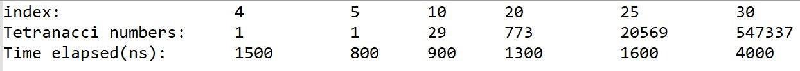
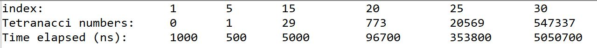

# Tetranacci Experiment
An experiment to show which type of recursion is most efficient for calculating Tetranacci numbers

## How It Is Done
In this program, we calculate the tetranacci numbers with two different approaches. In the "BadTetranacci" case, we implement the recursion using *multiple recursion*. On the other hand, in the "GoodTetranacci" case, we implement it using *linear recursion*. The time it takes to calculate each number is measured and compared between the tow approches.
Since multiple recursion gives rise to more recursive calls at each step, it is much slower.

## Results
The following demonstrates the results for, good Tertranacci:

and Bad tetranacci:

